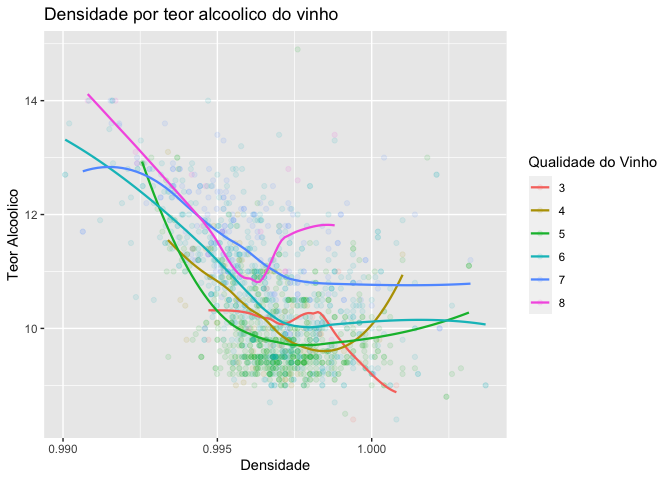
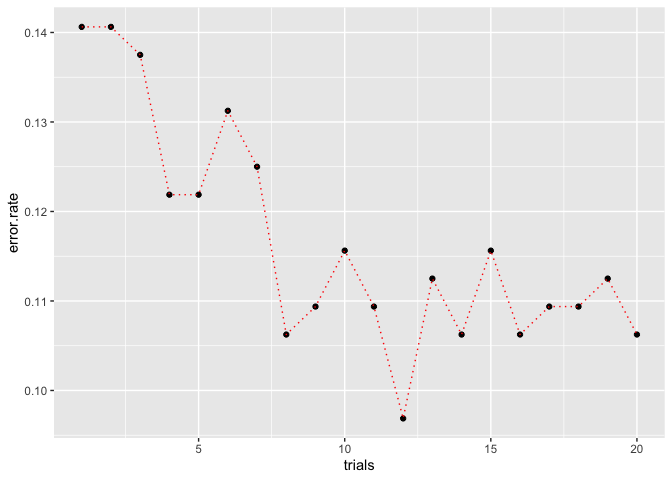

Red Wine Quality
================

Este projeto tem por objetivo treinar um modelo do machine learning para
prever a qualidade do vinho vermelho. Para este treinamento será
utilizado o modelo `Árvore de decisão`, por meio do pacote (`C50`).

## Dataset

O Dataset está disponível em: [Red Wine
Quality](https://www.kaggle.com/datasets/uciml/red-wine-quality-cortez-et-al-2009).

O Dataset apresenta os dados de 1599 vinhos, distribuídos entre 12
variáveis coletadas com base em testes físicos-químicos:

1.  `fixed acidity`

-   Representa a volatilidade dos ácidos presentes no vinho, ou seja,
    ácidos que não evaporam facilmente.

2.  `volatile acidity`

-   Representa a quantidade de ácido acético no vinho, ou seja, níveis
    muito altos podem causar um sabador de vinagre no vinho.

3.  `citric acid`

-   Representa a quantidade de ácido cítrico presente no vinho.

4.  `residual sugar`

-   Representa a quantidade de açúcar restante no vinho após o processo
    de fermentação.

5.  `chlorides`

-   Representa a quantidade de sal presente no vinho.

6.  `free sulfur dioxide`

-   Representa a quantidade de gás SO2 liberado.

7.  `total sulfur dioxide`

-   Representa o total de gás SO2.

8.  `density`

-   Representa a densidade do vinho.

9.  `pH`

-   Representa quão ácido ou básico é um vinho em uma escala de 0 (muito
    ácido) a 14 (muito básico);

10. `sulphates`

-   Um aditivo de vinho que pode contribuir para os níveis de dióxido de
    enxofre

11. `alcohol`

-   Representa a percentagem de teor alcoólico do vinho.

12 . `quality`

-   Representa a pontuação do vinho, em uma escala de 0 a 10. Sendo 0 um
    vinho considerado `ruim` e 10 um vinho `bom`.

## Análise Exploratória dos dados

Uma breve análise dos dados, para poder entender suas características.

<!-- -->

Como podemos ver pelo gráfico da `Distribuição da Qualidade`, a
qualidade do vinho predomina entre `5` e `6`.

<!-- -->

A partir do gráfico gerado, podemos observar que a tendência geral é que
quanto maior o teor álcoolico do vinho, menor a sua densidade. Nesta
análise, pode-se concluir também que quanto maior a qualidade do vinho,
maior o teor alcoólico e menor a densidade.

<!-- -->

Vemos que a densidade por açúcar residual tem uma distribuição bimodal
para os vinhos de maior qualidade e uma cauda longa para os de menor
qualidade mas de forma pouco significativa.

<!-- -->

O pH presentes nos vinhos, apresenta uma distribuição normal e bem
concentrada, na faixa entre `3.0` e `3.7`.

## Preparação dos dados para aplicação do modelo

Para preparação dos dados, foi necessário criar uma variável categorica
para a qualidade do vinho, aplicando o seguinte critério:

> Qualidade \< 5 = ruim, Qualidade \> 5 & Qualidade \< 6 = normal,
> Qualidade \> 6 = boa

Com isso os dados ficaram distribuidos da seguinte forma:

| Var1   |      Freq |
|:-------|----------:|
| bom    | 0.1357098 |
| normal | 0.8248906 |
| ruim   | 0.0393996 |

Distribuição dos dados originais

Os dados foram separados aleatoriamente entre dados de ‘test’ e
‘training’, onde 80% dos dados foram separados para testes e os 20%
restantes separados para treinamento do modelo.

Após a separação os dados ficaram distruibuidos da seguinte forma:

| Var1   |      Freq |
|:-------|----------:|
| bom    | 0.1469898 |
| normal | 0.8123534 |
| ruim   | 0.0406568 |

Distribuição dos dados de treinamento

| Var1   |     Freq |
|:-------|---------:|
| bom    | 0.090625 |
| normal | 0.875000 |
| ruim   | 0.034375 |

Distribuição dos dados de testes

É possível notar que os dados não estão distribuídos de maneira
uniforme, pois em ambos os datasets há uma maior concentração de vinhos
considerados `normais`, cerca de 80%, porém segue a distribuição dos
dados originais.

## Aplicação do Modelo

Utilizando os dados separados para treinamento e aplicando o modelo de
classificação C5.0 e posteriormente fazendo a predição, utilizando a
função `predict`, do modelo gerado após o treinamento e o dados
separados para testes, gerou a seguinte matriz de confusão.

<!-- -->

Conforme a tabela abaixo é possível ver que o modelo teve uma precisão
não tão alta, cerca de `85%`.

|                | confusionMatrix.overall |
|:---------------|------------------------:|
| Accuracy       |               0.8593750 |
| Kappa          |               0.3533031 |
| AccuracyLower  |               0.8163925 |
| AccuracyUpper  |               0.8955429 |
| AccuracyNull   |               0.8843750 |
| AccuracyPValue |               0.9281729 |
| McnemarPValue  |                     NaN |

Precisão do modelo

### Utilizando mais árvores

Em tempo, foi aplicado o modelo com até 20 árvores de decisão, a fim de
obter a melhor precisão. Dessa forma, obteve-se o seguinte gráfico:

<!-- -->

Observando, é possível perceber que o modelo não possui uma regularidade
na execução, pois a precisão varia muito conforme o número de árvores,
tendo a melhor precisão com 12 árvores com cerca de `96%` de precisão.

Por outro lado, talvez não tenha vantagem em usar as 12 árvores, pois a
partir de 8 árvores não se tem ganhos significativos de precisão,
ficando na faixa dos `90%`.

O repositório deste projeto pode ser encontrado em:
[Wine-Quality](https://github.com/williamsimionatto/Wine-Quality)
